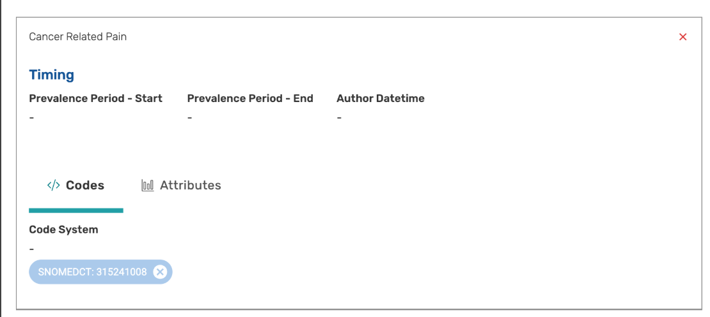

This topic discusses the issue raised in [CQLIT-572](https://oncprojectracking.healthit.gov/support/browse/CQLIT-572), specifically the semantics of an interval with null boundaries

```cql
define "Inpatient Encounter with Cancer Related Pain":
  ["Encounter, Performed": "Inpatient"] Encounter
    where exists (
        ["Diagnosis": "Cancer Related Pain"] CancerPain
          where CancerPain.prevalencePeriod overlaps day of Encounter.relevantPeriod
    )
```

For the test case in question, the Patient has a "Cancer Related Pain" diagnosis with a prevalence period that has a null start and end.

When an interval in CQL has a null boundary, there are two possible interpretations:

* If the boundary is open (i.e. exclusive) (e.g. `Interval[Now(), null)`), it means the boundary point is unknown
* If the boundary is closed (i.e. inclusive) (e.g. `Interval[Now(), null]`), it means the boundary point is the maximum possible value for the ending boundary, or the minimum value for the starting boundary.

If both boundaries are null, this means:

* `Interval(null, null)` - Unknown start and end, effectively the same as null
* `Interval[null, null]` - Minimum start and end, effectively, "for all time"

Source: [Operating on Intervals](https://cql.hl7.org/02-authorsguide.html#operating-on-intervals), also [Start](https://cql.hl7.org/09-b-cqlreference.html#start) and [End](https://cql.hl7.org/09-b-cqlreference.html#end)

So, given an Encounter:

```json
{
    "qdmDataType": "Encounter, Performed",
    "relevantPeriod": "Interval[@2026-01-01T10:00:00.0, @2026-01-01T14:00:00.0]"
}
```

And a Diaganosis:

```json
{
    "qdmDataType": "Diagnosis",
    "code": "Cancer Related Pain Code",
    "prevalencePeriod": "Interval[null, null]"
}
```

then the overlap being tested is:

```cql
  Interval[null, null] overlaps day of Interval[@2026-01-01T10:00:00.0, @2026-01-01T14:00:00.0]
```

which should evaluate to `true`, and the encounter should be returned.

```cql
define "Inpatient Encounter with Cancer Related Pain":
  ["Encounter, Performed": "Inpatient"] Encounter
    where exists (
        ["Diagnosis": "Cancer Related Pain"] CancerPain
          where CancerPain.prevalencePeriod overlaps day of Encounter.relevantPeriod
    )
```

However, if the "null start and end" is actually represented as:

```json
{
    "qdmDataType": "Diagnosis",
    "code": "Cancer Related Pain Code",
    "prevalencePeriod": null
}
```

Then the overlap being tested is:

```cql
  null overlaps day of Interval[@2026-01-01T10:00:00.0, @2026-01-01T14:00:00.0]
```

which should evaluate to `null` and the encounter should _not_ be returned.

So how the test behaves will be dependent on how the actual Interval value is being represented in the underlying data.

We have confirmed that when a Diagnosis is entered with a null start and end in MADiE:



 the actual QDM representation that is sent to the engine is:

```json
{
    "prevalencePeriod": {
        "qdmDataType": "Interval",
        "high": null,
        "highClosed": true,
        "low": null,
        "lowClosed": true
    }
}
```

Credit to the MITRE CQL-Execution Team for the investigation and solutions that follow:

In investigating and correcting this issue, the following example was encountered:

```cql
Interval[null, 0] includes Interval(null, 0]
```

In plain language, this expression is asking whether an interval from the lowest possible integer to 0 includes an interval from some value between the lowest possible integer and 0 to 0. Intuitively, this is true, because no matter what value the second interval starts at, it is in the range from the lowest possible integer to 0.

As part of addressing this issue, several technical corrections to examples in the specification, as well as a clarification on how Start and End boundaries are determined was submitted. Specifically, the [Author's Guide](https://cql.hl7.org/02-authorsguide.html#operating-on-intervals) states:

> If a boundary point is null and the boundary is exclusive, the boundary is considered unknown, and represents an uncertainty between the boundary and the minimum or maximum value for the point type of the interval.

However, the current definitions of [Start](https://cql.hl7.org/09-b-cqlreference.html#start) and [End](https://cql.hl7.org/09-b-cqlreference.html#end) lose this nuance:

> If the [low|high] boundary of the interval is open... [and] the low value of the interval is null, the result is null.

Correcting the definitions of Start and End to consider the uncertainty:

> If the low boundary of the interval is open and null, this operator returns an uncertainty from the minimum value for the point type of the interval to the high boundary of the interval (using End operator semantics to determine the high boundary).

This corrects the inconsistency in the specification, and with these new semantics, the expression:

```cql
Interval[null, 0] includes Interval(null, 0]
```

now returns true as expected.

