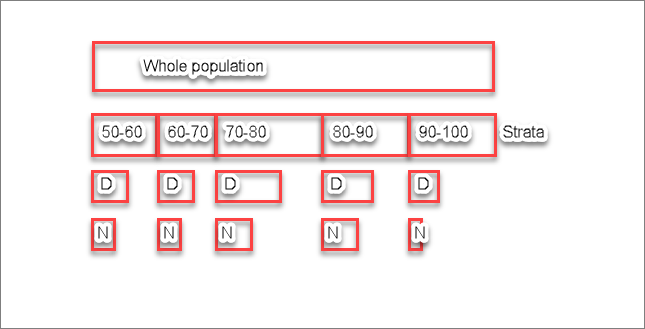

# Stratifiers

Question: Do the strata end up being the first ‘filter’ applied to the population? For example, if we take a hypothetical measure with patients age 50 to 100, that has age strata in 10-year increments, do the population criteria for each grouping get broken out within each of those 10-year age buckets? (D represents a denominator and N represents a numerator within each stratum in the image below:



Answer: There is no implication or expectation about _order_ of application for stratifiers. Generally speaking, a stratifier is expected to be a complete and disjoint partitioning of the population, though we don't in general have a way of enforcing (or even detecting compliance with) that expectation. Conceptually, stratifiers are applied _on top of_ the population criteria for a measure, and implementations will vary in how they calculate stratifiers. For implementations that perform case-at-a-time processing, the stratifiers may be calculated and collected as part of processing each case, whereas for implementations that evaluate at the population level, stratifiers may be calculated independently.

To illustrate, consider the FHIR-based representation of CMS74:

```
define "Initial Population":
  AgeInYearsAt(start of "Measurement Period") >= 6
    and AgeInYearsAt(start of "Measurement Period") < 20
    and exists ( "Qualifying Encounters" )

define "Denominator":
  "Initial Population"

define "Denominator Exclusions":
  Hospice."Has Hospice"

define "Numerator":
  exists ( ["Procedure": "Fluoride Varnish Application for Children"] FluorideApplication
    where FluorideApplication.performed during "Measurement Period"
      and FluorideApplication.status = 'completed'
  )
```

And the stratifiers:

```
define "Stratification 1":
  AgeInMonthsAt(start of "Measurement Period") >= 6
    and AgeInYearsAt(start of "Measurement Period") <= 4

define "Stratification 2":
  AgeInYearsAt(start of "Measurement Period") >= 5
    and AgeInYearsAt(start of "Measurement Period") <= 11

define "Stratification 3":
  AgeInYearsAt(start of "Measurement Period") >= 12
    and AgeInYearsAt(start of "Measurement Period") < 20
```

Note that the criteria have been rewritten here to make use of the "AgeInXXXAt" functions for simplicity.

Effectively, the stratifiers are _applied_ to the other criteria to establish each stratum. For example, stratifier 1 is effectively calculated as:

```
define "Initial Population for Stratifier 1":
  AgeInYearsAt(start of "Measurement Period") >= 6
    and AgeInYearsAt(start of "Measurement Period") < 20
    and exists ( "Qualifying Encounters" )
    // AND the Stratifier 1 criteria
    and AgeInYearsAt(start of "Measurement Period") >= 12
    and AgeInYearsAt(start of "Measurement Period") < 20

define "Denominator":
  "Initial Population"
    // AND the Stratifier 1 criteria
    and AgeInYearsAt(start of "Measurement Period") >= 12
    and AgeInYearsAt(start of "Measurement Period") < 20

define "Denominator Exclusions":
  Hospice."Has Hospice"
    // AND the Stratifier 1 criteria
    and AgeInYearsAt(start of "Measurement Period") >= 12
    and AgeInYearsAt(start of "Measurement Period") < 20

define "Numerator":
  exists ( ["Procedure": "Fluoride Varnish Application for Children"] FluorideApplication
    where FluorideApplication.performed during "Measurement Period"
      and FluorideApplication.status = 'completed'
  )
    // AND the Stratifier 1 criteria
    and AgeInYearsAt(start of "Measurement Period") >= 12
    and AgeInYearsAt(start of "Measurement Period") < 20
```

So the result in a population-level report includes both the results for the unstratified population criteria, as well as the results for each stratifier.

Discussion: Note that the FHIR-based representation of stratifiers allows for another potential approach:

First, declare terminology to appropriately represent the age groups, for example:

```
codesystem "ISO-8601-Derived Periods": 'http://ohie.org/CodeSystem/iso-8601-derived-periods' // { 'P0Y--P1Y', 'P1Y--P5Y', ... }

// Age Groups
code "P6M--P4Y": 'P6M--P4Y' from "ISO-8601-Derived Periods" display '6 months-4 years'
code "P5Y--P11Y": 'P15Y--P19Y' from "ISO-8601-Derived Periods" display '5 years-11 years'
code "P12Y--P19Y": 'P12Y--P19Y' from "ISO-8601-Derived Periods" display '12 years - 19 years'
```

Then, express a single "Age" stratifier that returns the appropriate code as calculated for the case:

```
/*
By Patient Age as of the start of the Measurement Period
Age (6 months-4 years, 5-11 years, 12-19 years)
*/
define "By Age":
  case
    when AgeInMonthsAt(start of "Measurement Period") >= 6
      and AgeInYearsAt(start of "Measurement Period") <= 4 then "P6M--P4Y"
    when AgeInYearsAt(start of "Measurement Period") in Interval[5, 11] then "P5Y--P11Y"
    when AgeInYearsAt(start of "Measurement Period") in Interval[12, 19] then "P12Y--P19Y"
    else null
  end
```
