# Intervals And Lists

## Intervals

CQL supports intervals for numbers and date/time values.

Intervals use standard mathematical notation to indicate _open_ and _closed_ (i.e. whether the endpoint is included in (_closed_) or excluded (_open_) from the interval:

```cql
Interval[3, 5)       // 3, 4
Interval[3.0, 5.0)   // >= 3.0, < 5.0
Interval[@2014-01-01T00:00:00.0, @2015-01-01T00:00:00.0]
```

Note that the ending boundary must be greater than or equal to the starting boundary to construct a valid interval:

```cql
Interval[1, -1]  // Invalid interval
Interval[1, 1]   // "Unit" interval, containing only a single point
Interval[1, 1)   // Invalid, conflicting to say it includes and excludes the point 1
```

For any interval value, you can also use the property names `low` `lowClosed`, `high`, and `highClosed` to access the boundary points and closed indicators of the interval:

```cql
Interval[3, 5).high
Interval[3, 5).highClosed
```

### Basic Operators

You can test for membership with `contains` and `in`:

```cql
Interval[3, 5) contains 4     // true
4 in Interval[3, 5)           // true
```

You can determine the boundaries of an interval using `start of` and `end of`

```cql
start of Interval[3, 5) // 3
end of Interval[3, 4)   // 4
```

For a "unit" interval, you can use `point from` to extract the single point:

```cql
point from Interval[1, 1]  // 1
point from Interval[1, 2]  // Error, point from can only be used on unit intervals
```

You can determine width and size of an interval:

```cql
width of Interval[3, 5)    // 1
width of Interval[3, 5]    // 2
Size(Interval[3, 5]        // 3, because the interval contains the points 3, 4, and 5
```

The `size` of an interval is the number of points it contains, whereas the width of an interval is how wide it is on the number line.

### Comparing Intervals

You can compare intervals to determine how they are related, the `same as`, `before`, `after`, `meets`, `overlaps`, or `during`.

For meets and overlaps, you can also use the suffixes `before` and `after` to determine whether the intervals meet or overlap before or after.

```cql
Interval[3, 5) = Interval[3, 4]
Interval[1, 2] before Interval[3, 4]
Interval[3, 4] after Interval[1, 2]
Interval[1, 2] meets Interval[3, 4]
Interval[1, 5] overlaps Interval[3, 6]
Interval[1, 2] starts Interval[1, 5]
Interval[2, 4] included in Interval[1, 5]
Interval[1, 5] includes Interval[2, 4]
Interval[4, 5] ends Interval[1, 5]
```

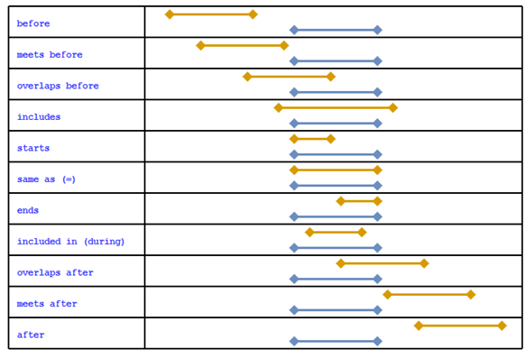

### Timing Phrases

CQL also supports timing phrases that make it easier to express precise relationships between intervals using natural language.

The `before` and `after` operators can have a prefix of `starts` or `ends`, and a suffix of `start` or `end`.

```cql
IntervalX starts before start IntervalY
```

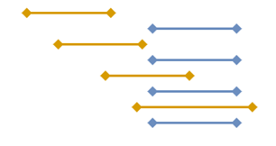

The `before` and `after` operators can also take an offset that indicates how far away a given relationship should be.

The offset can be absolute, indicating that the boundary of the interval must be on the offset, or it can be relative, indicating that the boundary must be at least on the offset.

```cql
IntervalX starts 3 days before start IntervalY
IntervalX starts 3 days or more before start IntervalY
```

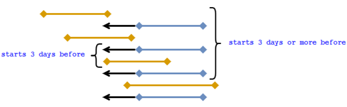

You can also specify a range for the boundary relationship using the `within...of` keyword

```cql
IntervalX starts within 3 days of start IntervalY
```

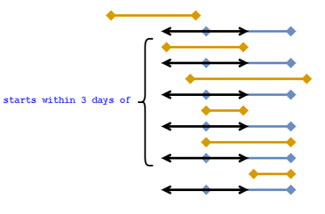

### Computing Intervals

CQL provides several operators that can be used to cimbine existing intervals to compute new intervals:

```cql
Interval[1, 3] union Interval[3, 6]
Interval[1, 4] intersect Interval[3, 6]
Interval[1, 4] except Interval[3, 6]
```

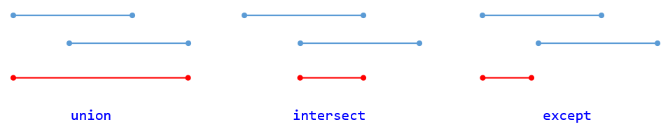

## List Values

CQL supports lists of values of any type

```cql
{ 1, 2, 3, 4, 5 }

{ 
  { X: 1, Y: 1 }, 
  { X: 2, Y: 2 } 
}
```

CQL lists may contain nulls and duplicates

```cql
{ 1, 'abc', null }
{ 1, 1, 2, 2, 3, 3 }
```

List values in CQL are 0-based

### Operating on Lists

List membership uses equality comparison

```cql
{ 'a', 'b', 'c'}[1] // 'b'
IndexOf({ 1, 2, 3 }, 2) // 1
```

Length returns the number of elements in a list

```cql
Length({ 1, 'abc', null }) // 3

`singleton from` throws a run-time error if the list contains more than one element

```cql
First({ 1, 2, 3 }) // 1
Last({ 1, 2, 3 }) // 3
singleton from { 1 } // 1
singleton from { 1, 2, 3 } // Error
```

`Take`, `Skip`, and `Tail` support extracting sub-lists by position

```cql
Take({ 1, 2, 3, 4 }, 2) // { 1, 2 }
Skip({ 1, 2, 3, 4 }, 2) // { 3, 4 }
Tail({ 1, 2, 3, 4 }) // { 2, 3, 4 }
```

### Comparing Lists

You can test for membership of items in a list using the `contains` and `in` operators.

You can compare lists using equality (=) and `includes` and `included in` operators:

```cql
X contains 3        // true
3 in X              // true
X includes Y        // true
Y included in X     // true
```

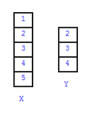

### Computing Lists

CQL supports list computation using `union`, `intersect`, and `except`

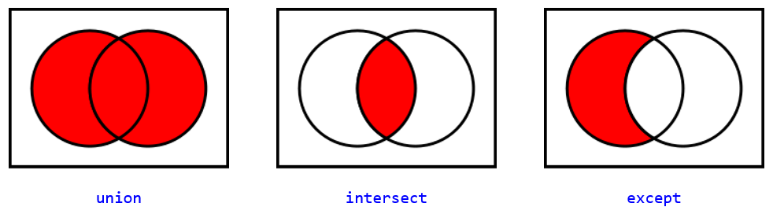

The `union` operator combines two lists, eliminating duplicates.

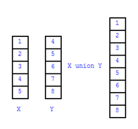

Union can also be used to combine lists of different types, resulting in a choice list

```cql
{ 1, 2, 3 } union { 'a', 'b', 'c' } // List<Choice<Integer, String>>
```

The `Combine` function can be used to combine two lists without eliminating duplciates.

The `intersect` operators results in a list containing only the elemebnts that appear in both lists.

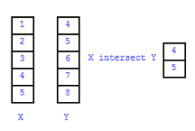

The `except` operator results in a list containing only the elements of the first list that are not present in the second list

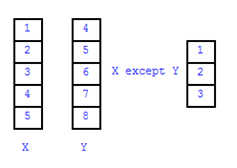

### Aggregates (Lists of Values)

CQL supports a standard set of aggeregate and statistical operators

`null` elements are ignored in aggregate calculations

Except for `Count`, `AllTrue`, and `AnyTrue`, aggregates of an empty list return `null`

```cql
Count({ 1, 2, 3, null})
Sum({ 1, 2, 3, null })
Min({ 1, 2, 3, null })
Max({ 1, 2, 3, null })
Avg({ 1, 2, 3, null })
Median({ 1, 2, 3, null })
Mode({ 1, 2, 3, null })
Variance({ 1, 2, 3, null })
StdDev({ 1, 2, 3, null })
PopulationVariance({ 1, 2, 3, null })
PopulationStdDev({ 1, 2, 3, null })
```

CQL also defines Boolean aggregates:

```cql
AllTrue({ true, false, true })
AnyTrue({ true, false, true })
```

### Lists of Strings

Combine can be used to concatenate a list of strings, with or without a separator

Split separates a string into a list of strings based on a given separator

```cql
Combine({ 'ab', 'cd', 'ef' }) // `abcdef`
Combine({ 'completed', 'refused', 'pending' }, ';')
Split('completed;refused;pending', ';')
```

### Lists of Lists

`flatten` returns the elements of each list, without eliminating duplicates

`distinct` eliminates duplicates

`flatten` only works on the first level

`flatten` works on choice lists as well

```cql
flatten { { 1, 2, 3 }, { 2, 3, 4 }, { 3, 4, 5 } }

distinct { 1, 2, 3, 2, 3, 4, 3, 4, 5 }

{ { 1, 2, 3 }, { { 'a', 'b' }, { 'x', 'y' } } }

{ { 1, 2, 3 }, 2, 3, 4 }
```

### Lists of Intervals

Given a list of potentially overlapping intervals, what is the unique set of _covering_ intervals?

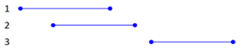

```cql
collapse { Interval[1, 6], Interval[3, 7], Interval[9, 12] }
```

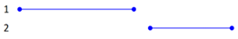

The opposite of `collapse`, `epxand` results in a list of unit intervals covering the same range as the input.

`expand` can also be used to expand an interval into a list:

 ```cql
 expand Interval[1, 10] = { 1, 2, 3, 4, 5, 6, 7, 8, 9, 10 }
 ```


