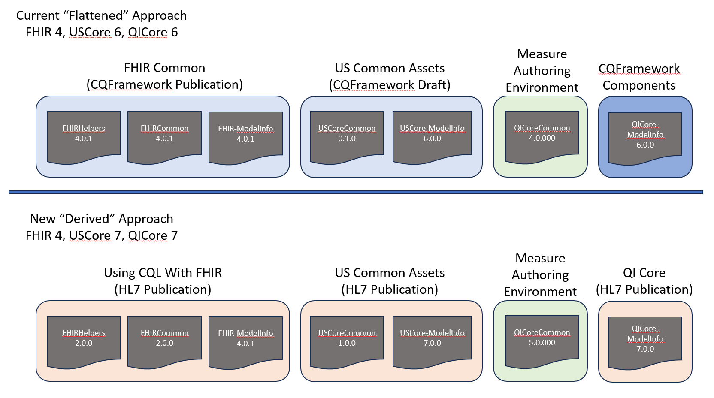

This use of derived models now supports refactoring of the Common libraries to better facilitate reuse and sharing across domains and use cases, as illustrated in the following diagram:

In the current state, it is difficult to share common libraries and model information files. The most common mechanism for sharing them is by direct inclusion in CQFramework components such as the CQL-to-ELM translator. More recently, some sharing has been possible through CQFramework publications such as FHIR Common Assets, but this approach has still been limited by the "flattened" approach to model info files.

With derived model info, we can now fully support sharing and integration of multiple implementation guides.

As shown in the diagram, FHIRCommon and the core FHIR-ModelInfo will be available in the Using CQL With FHIR implementation guide, USCoreCommon and USCore-ModelInfo will be available in the Common CQL Assets for FHIR (US) implementation guide, and QICore-ModelInfo will be published in the QICore implementation guide directly. Note that going forward, USCore-ModelInfo will also be included in the USCore implementation guide directly (as of 8.0.0).

One of the main consequences of this is that content and logic that previously had to be duplicated can now be shared across FHIR, USCore, and QICore (and any other implementation guide such as SDOH, ODH, etc).

In the following sections, we'll review the primary changes going into the Using CQL With FHIR and Common CQL Assets for FHIR publications that are enabled by the derived model info approach.

> NOTE: This is an overview of changes, rather than an exhaustive list. See the [Complete Diff in Github](https://github.com/cqframework/CQL-Formatting-and-Usage-Wiki/pull/30/files#diff-24f7f36d7a2f6f338c7c499c069a0c42834bb333cf5213d89c3e74fa9b107e75)

## FHIRCommon Changes

* Removed all functions that were deprecated in the previous version (e.g. ToInterval)
* Added interval functions from QICoreCommon (hasStart, hasEnd, earliest, latest)
* Renamed extensions/extension to exts/ext
* Removed BaseExtension accessor functions
* Added Observation helper functions (isLaboratory, isResulted, etc.)
* Added Condition helper functions (isActive, isProblemListItem, etc.)
* Added AllergyIntolerance helper functions (isActive, isRefuted, etc.)
* Added MedicationRequest helper functions (isCommunity, isDischarge, etc.)
* Added Encounter helper functions (isFinished, etc.)
* Added Most Recent functions

## USCoreCommon Changes

Most of the content that was in USCoreCommon was a duplication of functionality in FHIRCommon, just expressed against the USCore model because it was flattened. Now that it is derived, most of what was in USCoreCommon no longer needs to be restated, so it now contains only USCore-specific content:

* Health concern USCore condition category and related functions
* USCore-specific extension helper functions (e.g. race, ethnicity, etc.)
* USCore-specific slice helper functions (e.g. systolic, diastolic, etc.)

## QICoreCommon Changes

As with USCoreCommon, most of the content that was in QICoreCommon was a duplication of functionality in FHIRCommon, but expressed against QICore. Now that QICore is derived, QICoreCommon only needs to include QICore-specific content. After this refactoring that consists only of:

* Task-related declarations (e.g. Fulfill)
* Day-related functions used for cumulative medication duration

And note that neither of these are necessarily specific to QICore (or even USCore), so it could be that we want to just refactor QICoreCommon entirely into FHIRCommon. Feedback on this is requested.