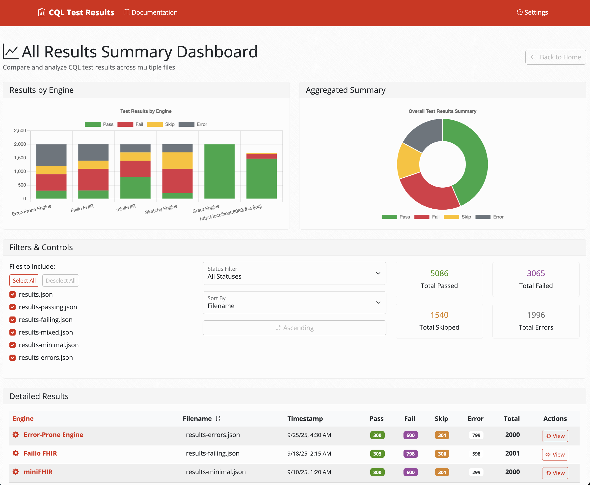

HL7 FHIR Connectathon 40 was the weekend before last, we participated in the Clinical Reasoning track. We had great participation and focused on the following participant goals:

1. Test MADiE exported measure specifications in other environments (including VSCode plugin and FHIR Servers)
2. Run CQL engine test suite on as many participant engines as we can
3. Exchange data and data quality results with the PIQI track
4. Test terminology capabilities of participant terminology servers
5. Test DEQM participant servers using the DEQM STU5 Inferno Test Kit

## Measure Testing in VSCode Plugin

We got expected and actual results for all test cases for all 73 measures, using a set of scripts developed by participants to:

1. Extract expected results from the MeasureReport resources across the test cases
2. Extract actual results from the results files produced by the running the test cases in the VSCode plugin
3. Compare the expected to the actual results

To try these scripts out yourself, follow the instructions here:

https://github.com/cqframework/dqm-content-qicore-2025/tree/master/scripts

The detailed results as of the connectathon are available here:

https://docs.google.com/spreadsheets/d/1Ij7XeUWpIZ7rRi0qtCoVXQM9T8qYwCNjbM-Uh93hRk0/edit?gid=1531398793#gid=1531398793

The summary indicates we are currently passing 10470 of 15691 (this is counting each population as a separate test)

> NOTE: A Firely participant noted that the comparison is actually a bit off, so these numbers are currently skewed, because the comparison is looking at raw results, whereas the expected results are cumulative (i.e. considering population membership). We're working to address this [issue](https://github.com/cqframework/dqm-content-qicore-2025/issues/21).

## CQL Engine Parity Testing

We got CQL engine test suite results for 3 different engines:

* Java open source - passing 1298
* Cozeva engine results - passing 1025
* Firely .NET engine results - passing 1470

Detailed results available here: https://github.com/cqframework/cql-tests-results

A participant also created a viewer for these results, screenshot here:

To try it, docker run -it -p 4200:80 --rm --pull always hlseven/quality-cql-tests-ui:latest, open http://localhost:4200 and click "Load Example Results File".

For a detailed report of the connectathon, refer to the [Track Report](https://docs.google.com/document/d/1YeVBt5nvbf81nokDlKBzKsnXaGJxthY8/edit#heading=h.5evemd5po6kr)